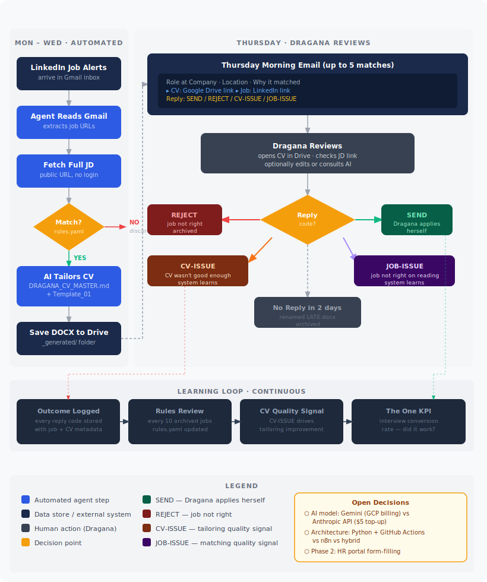

# Find The Right Job

> An AI-powered personal job application agent, built to solve a problem I was tired of having.

---

## The Problem

Job searching at a senior level is a full-time job in itself.

Every day, new postings appear. A handful look genuinely relevant. For each one worth applying to, you need to tailor your CV: not just swap a few words, but genuinely reframe your experience to match what the role is asking for, in language that both a human recruiter and an ATS system will respond to.

The **ATS problem** is the one most people underestimate. Before a human ever reads your CV, a software system scores it against the job description. Score too low and you are out before anyone sees your name. So you are not writing one CV. You are writing a different version for every application, optimised for a machine and for a person simultaneously, while staying completely honest about your actual experience.

Multiply that by five applications a week. The overhead becomes significant, and most of it is repeatable work that does not require human judgment.

I decided to build an agent to handle the repeatable parts, so I can focus on the parts that actually do.

---

## What I Built

A Python-based AI agent that runs on a weekly schedule and:

- Reads **LinkedIn job alert emails** from Gmail
- Fetches and evaluates each job description against a defined set of matching rules
- **Tailors my CV** for each match using my documented career history and a fixed ATS-safe template
- Prepares a **Thursday morning digest**: up to 5 ready-to-review matches, each with a tailored CV (DOCX) and the original job link
- Learns from my feedback over time via four reply codes: `SEND` / `REJECT` / `CV-ISSUE` / `JOB-ISSUE`

I review every match and apply myself. The agent prepares; it never submits.

---

## How It Works

The workflow has three zones:
- **Monday to Wednesday (automated):** job discovery, matching, CV tailoring, saving to Google Drive
- **Thursday (human review):** Dragana reads the digest, opens each CV, decides
- **Continuous:** every reply feeds back into matching rules and CV quality improvement

[Full workflow description](docs/workflow-description.md)

---

## How I Approached It

Before writing any code, I ran a structured requirements phase: 30+ questions covering job filtering logic, CV preparation rules, notification design, feedback loops, privacy constraints, and what success actually means.

Some things I learned during that phase that changed the design:

- **LinkedIn automation is a ToS risk.** Full browser automation of a logged-in LinkedIn session can get your account restricted. The agent works only with what LinkedIn sends you (email alerts) and public job URLs, with no login and no scraping.
- **The reply code design matters.** A simple yes/no reply loses the signal that helps the system improve. `CV-ISSUE` vs `JOB-ISSUE` tells the system whether the problem was in matching or in tailoring, two very different things to fix.
- **Thursday only, not daily.** A daily ping would become noise. A single weekly ritual at a fixed time fits how senior job searching actually works.

Full requirements: [REQUIREMENTS.md](REQUIREMENTS.md)

---

## What This Is Really About

I am a senior transformation and delivery leader. I have spent 25 years helping organisations work smarter, which usually means understanding the real problem before jumping to a solution, then building something that actually lasts.

This project is my hands-on response to AI disruption. Not observing it from a distance, not just using AI tools as a productivity layer, but applying the same structured thinking I use professionally (requirements, design, constraints, tradeoffs) to build something end to end myself.

It is also honest about being a work in progress. The solution architecture is still being decided (Python + GitHub Actions versus n8n). The agent exists and runs. The design is solid. The iteration continues.

---

## Project Status

| Phase | Status |
|---|---|
| Requirements (30+ questions, documented) | Done |
| Workflow design | Done |
| Agent code: Gmail reader, job matcher, CV tailor, notifier | Built |
| AI model integration | In progress |
| Solution architecture decision (Python vs n8n) | Pending |
| GitHub Actions automation | Built |
| Private working repo (personal data, live agent) | Planned |

---

## Built With

- Python 3.12
- Gmail API (OAuth 2.0)
- Gemini API (CV tailoring)
- GitHub Actions (weekly schedule)
- Google Drive (CV storage)
- Claude Code (AI-assisted development throughout)

---

*Dragana Radic, Senior Transformation and Delivery Leader*  
[LinkedIn](https://www.linkedin.com/in/transformation-efficiency-people-leader)
